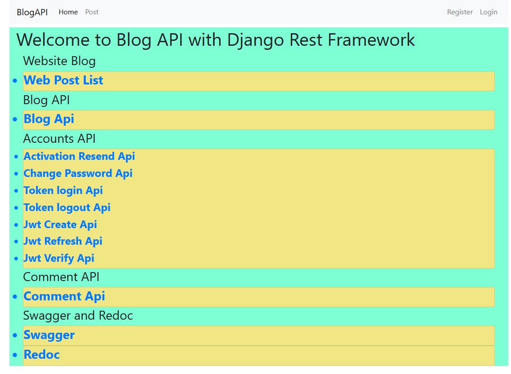
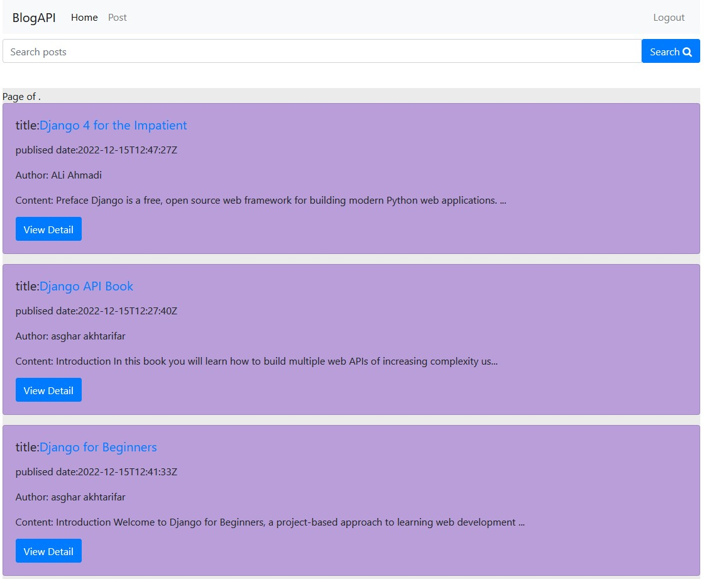
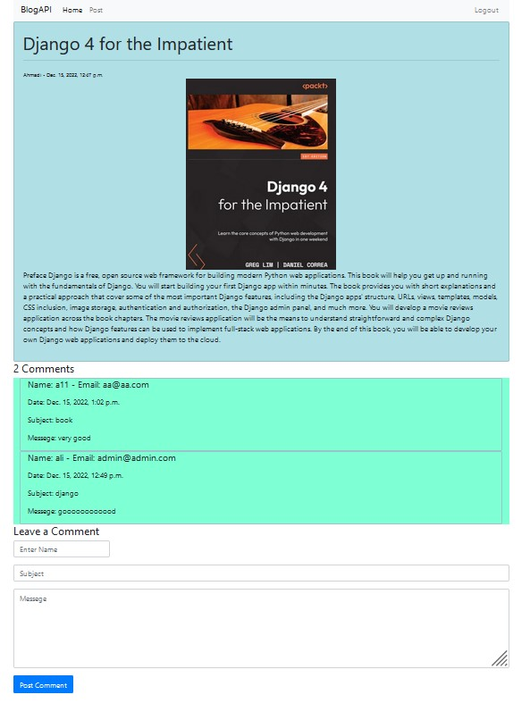
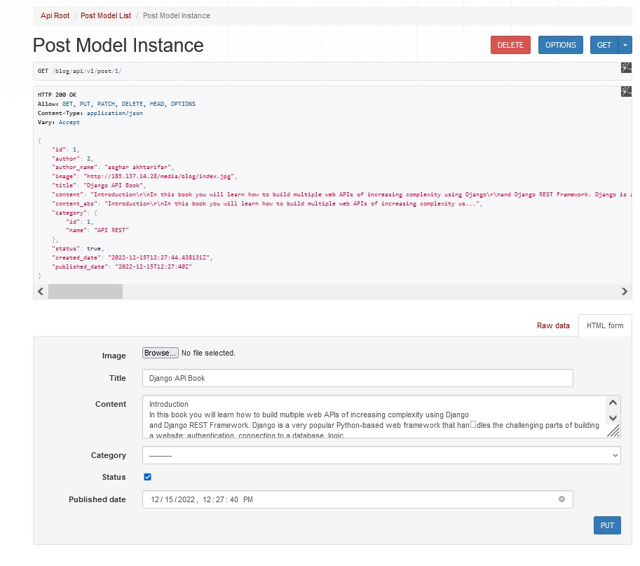
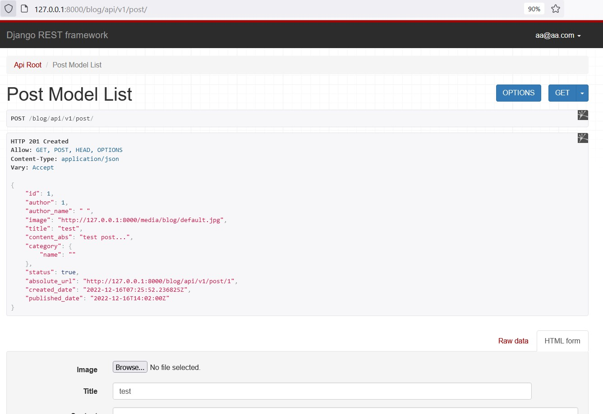
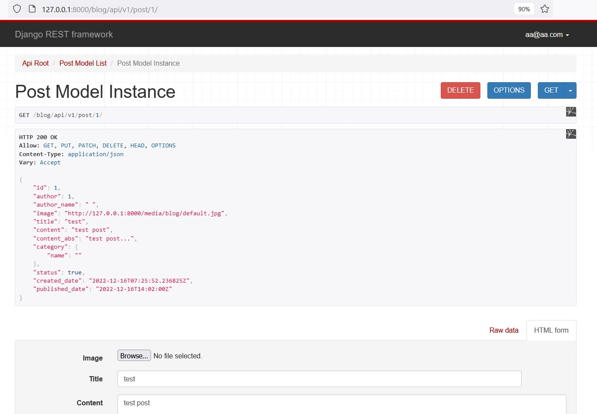
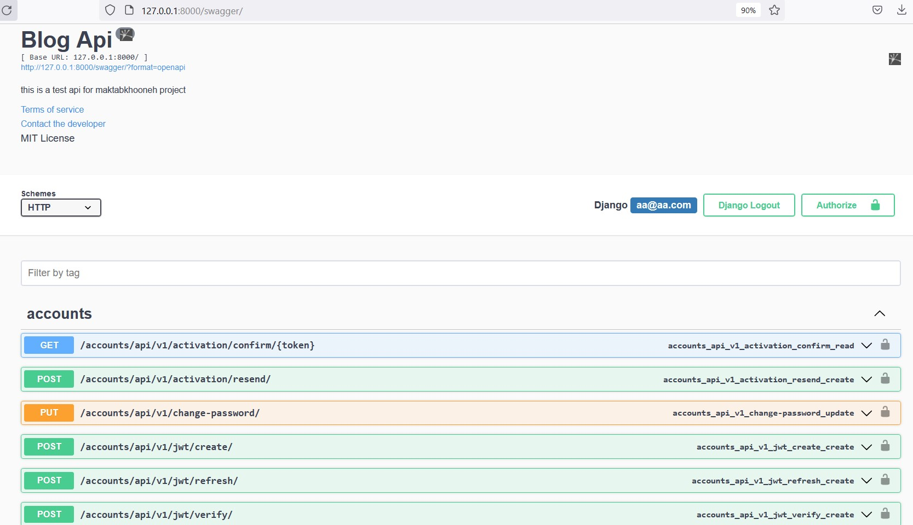

# Django-API-Rest-Framework-Web-Blog

Description:
Curse Django Advance in maktabkhooneh Project Final - 
A simple Blog Rest API based on Django-Rest-Framework

## Local Setup

```
$ git clone  https://github.com/rasaakh/Django-API-Rest-Framework-Web-Blog.git
$ docker-compose up --build

```

Navigate to the list view at [http://127.0.0.1:8000/blog/api/v1/post]














