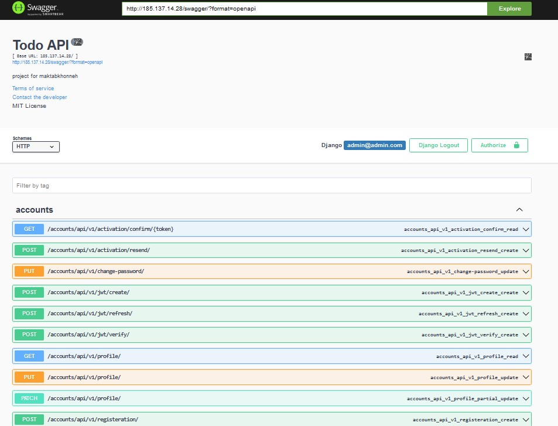
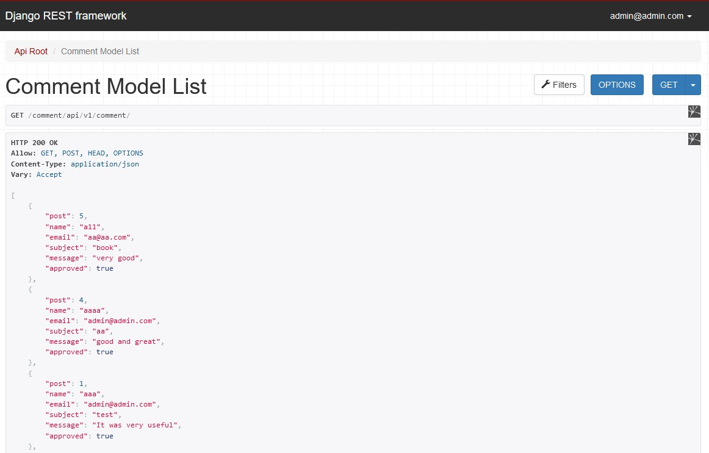

# Django-API-Rest-Framework-Web-Blog

Description:
Curse Django Advance in maktabkhooneh Project Final - 
A simple Blog Rest API based on Django-Rest-Framework

## Local Setup

```
$ git clone  https://github.com/rasaakh/Django-API-Rest-Framework-Web-Blog.git
$ docker compose -f docker-compose-stage.yml up --build -d

```

Navigate to the list view at [185.137.14.28/blog/api/v1/post]







